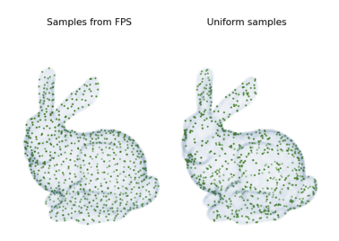

Farthest Point Sampling
=======================

Efficient Farthest Point Sampling: A performant Python implementation for subsampling large point clouds without exhaustive distance calculations. This lightweight library is optimized for performance and ease-of-use in large datasets, leveraging the power of NumPy.



_Example of Farthest Point Sampling (image source: [Minibatch AI Blog](https://minibatchai.com/sampling/2021/08/07/FPS.html))_

Table of Contents
-----------------

*   [Introduction](#introduction)
*   [Installation](#installation)
*   [Usage Examples](#usage-examples)

Introduction
------------

Farthest Point Sampling (FPS) is a widely used technique in computer graphics, machine learning, and computational geometry to reduce the size of a point cloud while preserving the overall structure. This Python implementation provides a fast and efficient way to perform FPS on large datasets without the need to compute all pairs of distances.

Installation
------------

To use this library, simply clone the repository to your local machine using the following command:

bashCopy code

`git clone https://github.com/yotamnahum/farthest-point-sampling.git`

Once the repository is cloned, you can import the `farthest_point_sampling` function from the main file in your Python scripts or Jupyter notebooks.

```python 

from farthest_point_sampling import farthest_point_sampling
```

Usage Examples
--------------

Here are some examples demonstrating how to use the `farthest_point_sampling` function:
```python 
### Basic Usage
import numpy as np
from farthest_point_sampling import farthest_point_sampling

data = np.random.rand(100, 1024)
point_idx = farthest_point_sampling(data, 3) 
print(point_idx)
# Output: array([80, 79, 27])
```

```python
### Specifying a Starting Point
import numpy as np
from farthest_point_sampling import farthest_point_sampling

data = np.random.rand(100, 1024)
point_idx = farthest_point_sampling(data, 5, start_idx=60)
print(point_idx)
# Output: array([60, 39, 59, 21, 73])`
```


Feel free to experiment with different datasets and tweak the parameters to achieve the desired level of point cloud reduction.
This efficient implementation makes it easy to incorporate Farthest Point Sampling into your projects for improved performance and resource usage.
